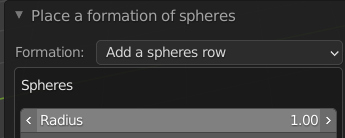
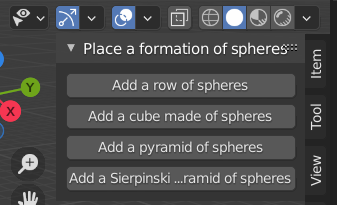
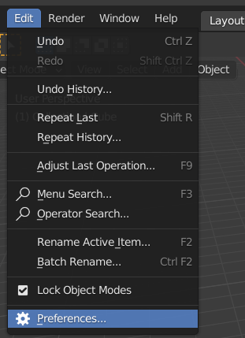
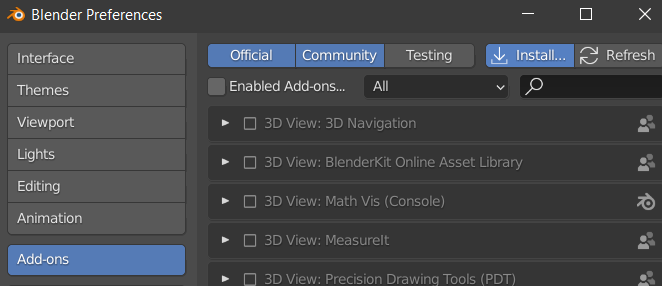
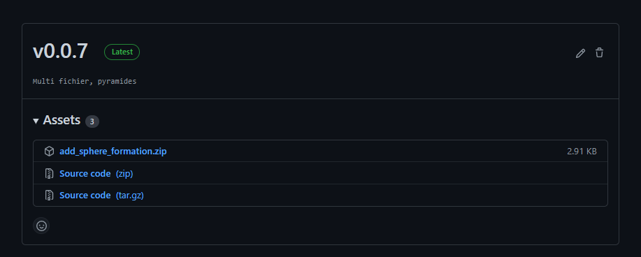

***

# Réaliser un plugin pour Blender 🔌

📚 Afin de faciliter le transfert de programmes développés avec l’API Python de
Blender (bpy), nous avons choisi de restituer les codes réalisés sous la forme de
plugins.<br>
Le présent document fourni une explication sur la réalisation d’add-ons,
installables sous Blender.
<br>
Cette explication sera illustrée de captures issues d'un plugin de génération de meshes. 
***

## Sommaire 📖

  - [Structure d'un plugin pour Blender](#structure-dun-plugin-pour-blender-📄)
    - [Du script au plugin,](#adapter-un-script-en-plugin) [fonctionnalités](#définir-des-classes-et-fonctions) [ et UI](#interface-utilisateur)
    - [Le fichier \_\_init\_\_.py](#le-fichier-__init__py)
  - [Partage du plugin via GitHub](#partage-du-plugin-via-github-📁)
    - [Installation d'un plugin](#installation-dun-plugin)
    - [Transfert sur GitHub](#transfert-sur-github)

***
***
<span style="color: Orange;">

## Structure d'un plugin pour Blender 📄

</span>
<br>


<span style="color: darkOrange;">

### Adapter un script en plugin
</span>


<span style="color: darkOrange;">

#### Définir des classes et fonctions
</span>


<br>

Un plugin fonctionnel comporte au moins un fichier Python, contenant lui-même une classe de type opérateur **```bpy.types.Operator```**. On inclut également une classe panel, qui peut être définie dans son propre fichier Python, et dont le contenu est détaillé dans la partie [interface](#interface-utilisateur). 

Par convention, la classe d'un opérateur doit être nommée ***TERME EN MAJUSCULE*\_OT\_*terme(s) complémentaire***, mais ce n'est pas obligatoire.

Dans une classe, on précise un identifant permettant de faire référence à la classe dans une autre, dans une variable **"bl_idname**.
<br>On précise également quelles sont les options de la classe dans une variable **bl_options**. Les options d'un opérateur sont **"REGISTER"** et **"UNDO"**, ils permettent l'affichage du menu de paramétrage.

<br>Exemple :

```python
class ADD_spheres_operator(bpy.types.Operator):

    bl_idname = "object.place_spheres_operator"
    bl_label = "Place a formation of spheres"
    bl_description = "This operator permits the addition of structures made of spheres"
    bl_options = {'REGISTER', 'UNDO'}

#Ici, on a redéfini l'identifiant de la classe, puis précisé un nom, une description, et ajouté les options de la classe.
```


Pour que l'utilisateur puisse parametrer les actions à réaliser avec l'add-on, on déclare des propriétés au sein de la classe *(Ou dans une classe extérieure de type PropertyGroup)*. On peut définir pour ces propriétés, un nom s'affichant dans l'interface, leur type, une valeur par défaut, et pour les valeurs numériques, s'il y a un minimum, un maximum ou encore le pas.

Exemple :

```python

# sp_radius représente le rayon d'une sphère, c'est une valeur de type float, dont on a choisi que le minimum serait 0.1, et le maximum 10. Sa valeur par défaut est 1.

sp_radius: bpy.props.FloatProperty(
        name="Radius",
        min=0.1,
        max=10,
        default=1)
```


Les fonctions définies dans les classes ne différent en rien de celles d'un projet Python habituel, mis à part l'utilisation de fonctions issues de bpy.

Il faut néanmoins déclarer une fonction **```execute(self, context):```** dans laquelle on précise quand executer les fonctions définiees, et on retourne toujours **```{'FINISHED}```**.

Il faut ensuite renseigner la classe dans les fonctions **```register()```** et **```unregister()```**, situées en dehors de la classe. Elles permettent de charger ou non cette dernière, selon l'état d'activation du plugin.

Exemple :
```python
def register():
    bpy.utils.register_class(OBJECT_PT_spheres_panel)
``` 

<span style="color: darkOrange;">

#### Interface utilisateur
</span>


<br>

Pour faciliter l'utilisation de l'add-on, on reprend les éléments fournis par l'interface de Blender pour le présenter sous forme d'options cliquables. 

Une classe de type **bpy.types.Panel** permet de définir un menu, contenant des indications ou boutons.
Cette classe doit avoir un nom correspondant à ***TERME EN MAJUSCULE*\_PT\_*terme(s) complémentaire***.

Par exemple :

```python
class OBJECT_PT_spheres_panel (bpy.types.Panel)
```
On peut renseigner à cette classe un identifiant **bl_idname**, un label de sous-menu **bl_label**, et le nom de l'onglet qui apparait dans la barre latérale **bl_category**<br>.
On intègre souvent dans ce panneau des boutons qui permettent d'executer les fonctionnalités du plugin.

Pour cela, on définit une fonction

```python 
def draw(self, context)
``` 
dans laquelle on peut lier des boutons de l'interface à un opérateur contenu dans une autre classe.<br>
Ici, on a défini différentes **action**s dans la classe de l'opérateur

```python
action: bpy.props.EnumProperty(
        items=[
            ('ADD_SPHERE_CUBE', 'Add a spheres cube', 'generate spheres cubes'),
            ('ADD_SPHERE_ROW', 'Add a spheres row', 'align spheres in a row'),
            ('ADD_SPHERE_PYR', 'Add a pyramid made of spheres','generate a pyrami of spheres'),
            ('ADD_SIERP_PYR', 'Add a Sierpinski styled pyramide made of spheres','generate a Sierpinski pyramid'),

        ], name="Formation")
```
 qui correspondent à diverses fonctions. C'est dans la fonction **execute()** de l'operateur que l'on détermine la fonction dont l'action est selectionnée.
<br>L'ajout de ces boutons dans l'interface consiste en la récupération du layout, puis à l'ajout d'opérateurs à ce dernier.

```python
    layout = self.layout

    layout.operator('object.place_spheres_operator',text='Add a row of spheres').action = 'ADD_SPHERE_ROW'
```
Résultat : 



<span style="color: grey;">

*La déclaration des attributs dans la classe d'un opérateur suffit à constituter le panneau d'ajustement apparaissant en bas à gauche de l'écran.<br> Si l'on souhaite modifier l'apparence de ce panneau, et décider dans quelles circonstances on peut agir sur certains attributs, on peut aussi déclarer une fonction `draw(self,content)` dans la classe de l'opérateur.*

</span>

***

<span style="color: darkOrange;">

### Le fichier \_\_init\_\_.py
</span>

<br>

Un add-on très léger peut être entièrement contenu dans un seul fichier python, tant qu'il présente l'import de l'APY bpy, et le dictionnaire "**bl_info**". Néanmoins, pour partager un add-on sous la forme d'une archive **.zip**, ou s'il est constitué de plusieurs fichiers python, Blender nécessite un fichier **_\_init__.py**,  qui lui permet de repérer quels fichiers constituent le plugin.

Dans ce fichier **_\_init__.py**, on importe tous les fichiers .py nécessaires au fonctionnement du plugin. On importe également le module bpy.

On inclut ensuite le dictionnaire **bl_info** qui permet de renseigner le nom de l'add-on, sa catégorie, sa version, la version de Blender sous laquel il est utilisable, ou encore un lien vers une documentation.
Ces informations sont ensuite présentes à titre indicatif dans la fenêtre de gestion des add-ons.

Exemple :
```python
# bl_info dans le template d'add-ons de Blender

bl_info = {
    "name": "New Object",
    "author": "Your Name Here",
    "version": (1, 0),
    "blender": (2, 80, 0),
    "location": "View3D > Add > Mesh > New Object",
    "description": "Adds a new Mesh Object",
    "warning": "",
    "doc_url": "",
    "category": "Add Mesh",
}
```

On définit les fonctions **register()** et **unregister()** en appelant celles définies dans les fichiers python importés. <br> Si elles n'ont pas été définies, on récupère les classes nécéssaires, et on les enregistre une par une directement dans ce fichier **\_\_init\_\_.py**.

Exemple :

```python
#On réutilise les fonctions définies dans un autre fichier 

def register():
    add_sphere_formation.register()

def unregister():
    add_sphere_formation.unregister()
```

L'ajout des lignes 

```python
if __name__ == "__main__":
    register()
```

permet de lancer le plugin via la console de commande dans Blender.

<br>


***
***
<span style="color: Orange;">

## Partage du plugin via GitHub 📁
</span>

<span style="color: darkOrange;">

### Installation d'un plugin

</span>

Pour installer un plugin depuis Blender, il faut se rendre sur l'onglet **"Edit"**, puis selectionner **"Preferences"**.<br>



Dans la fenêtre de préferences s'affichant, il faut selectionner l'onglet **"Add-ons"**, puis cliquer sur **"Install..."**.<br>



Une fenêtre d'explorateur de fichiers s'ouvre, il faut ensuite sélectionner l'archive du plugin.<br>
Une fois le plugin chargé, cocher la case présente à côté de son nom permet de l'activer.

***
<span style="color: darkOrange;">

### Transfert sur GitHub
</span>

Pour être installé directement par Blender, les fichiers d'un plugin doivent être placés dans le même dossier, et ce dossier doit être inclus dans une archive .zip.

Pour partager l'add-on sur GitHub, on utilise un fichier YAML nommé **release.yml** pour le déploiement continu. On y précise qu'une nouvelle release sera ajoutée à chaque envoi de tags,
```yaml
on:
  push:
    tags:
      - '*'
```
ce qui permet de garder plusieurs versions du projet.
<br>On précise également qu'une archive du fichier contenant les fichiers du plugin sera créée pendant le build. 
```yaml
        run: zip -r add_sphere_formation.zip add_sphere_formation
      - name: Release
```
Le plugin sera donc récupérable directement sous forme d'archive dans la section **Releases** du projet.

